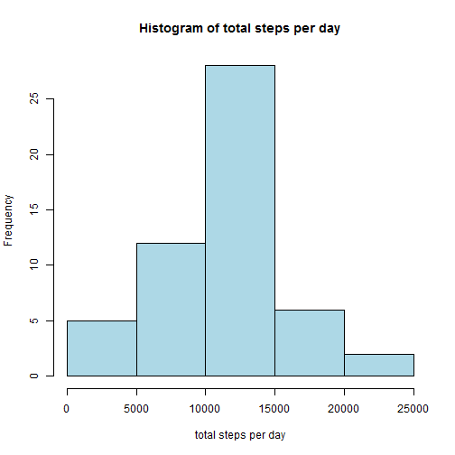
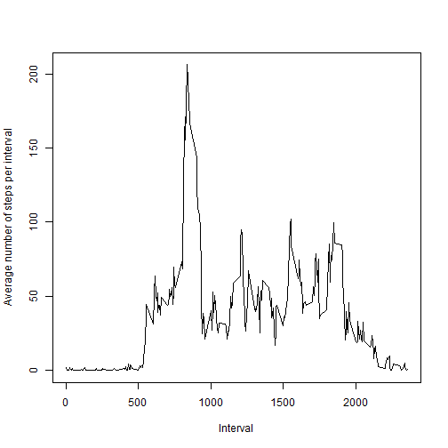
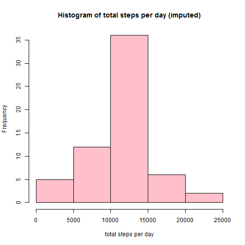
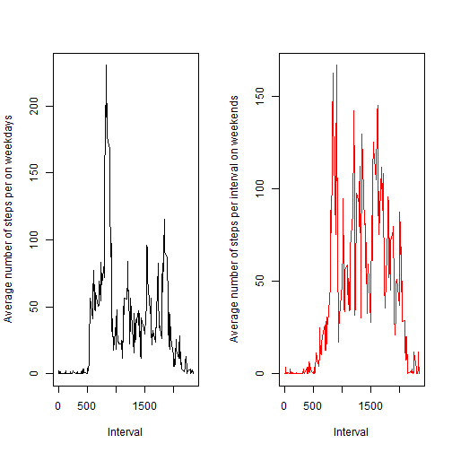

# Reproducible research course project 1

# Preparing the data

## 1.Load the data (i.e. read.csv())


```r
myDataPath <- "./reprProjectdata"
setwd(myDataPath)
if(!file.exists("./data")){dir.create("./data")}
 
fileUrl <- "https://d396qusza40orc.cloudfront.net/repdata%2Fdata%2Factivity.zip"
download.file(fileUrl,destfile="./data/Dataset.zip")
unzip(zipfile="./data/Dataset.zip",exdir="./data")
```

Import the csv data to the data frame for the analysis:


```r
activity <- read.csv("./data/activity.csv")
```

 
## 2.Process/transform the data (if necessary) into a format suitable for your analysis

Let's calculate the mean total number of steps taken per day. For this part of the assignment, we ignore the missing values in the dataset.


# Perform the general analysis:

## 1.Calculate the total number of steps taken per day


```r
tapply(activity$steps, activity$date, sum)
```

```
## 2012-10-01 2012-10-02 2012-10-03 2012-10-04 2012-10-05 2012-10-06 
##         NA        126      11352      12116      13294      15420 
## 2012-10-07 2012-10-08 2012-10-09 2012-10-10 2012-10-11 2012-10-12 
##      11015         NA      12811       9900      10304      17382 
## 2012-10-13 2012-10-14 2012-10-15 2012-10-16 2012-10-17 2012-10-18 
##      12426      15098      10139      15084      13452      10056 
## 2012-10-19 2012-10-20 2012-10-21 2012-10-22 2012-10-23 2012-10-24 
##      11829      10395       8821      13460       8918       8355 
## 2012-10-25 2012-10-26 2012-10-27 2012-10-28 2012-10-29 2012-10-30 
##       2492       6778      10119      11458       5018       9819 
## 2012-10-31 2012-11-01 2012-11-02 2012-11-03 2012-11-04 2012-11-05 
##      15414         NA      10600      10571         NA      10439 
## 2012-11-06 2012-11-07 2012-11-08 2012-11-09 2012-11-10 2012-11-11 
##       8334      12883       3219         NA         NA      12608 
## 2012-11-12 2012-11-13 2012-11-14 2012-11-15 2012-11-16 2012-11-17 
##      10765       7336         NA         41       5441      14339 
## 2012-11-18 2012-11-19 2012-11-20 2012-11-21 2012-11-22 2012-11-23 
##      15110       8841       4472      12787      20427      21194 
## 2012-11-24 2012-11-25 2012-11-26 2012-11-27 2012-11-28 2012-11-29 
##      14478      11834      11162      13646      10183       7047 
## 2012-11-30 
##         NA
```

 
## 2.Make a histogram of the total number of steps taken each day


```r
hist(tapply(activity$steps, activity$date, sum),
            xlab = "total steps per day",
            ylab = "Frequency",
            main = "Histogram of total steps per day",
            col = "lightblue"
            )
```



 
## 3.Calculate and report the mean and median of the total number of steps taken per day

* Mean number of steps is:


```r
mean(tapply(activity$steps, activity$date, sum), na.rm=TRUE)
```

```
## [1] 10766.19
```


* Median number of steps is:


```r
median(tapply(activity$steps, activity$date, sum), na.rm=TRUE)
```

```
## [1] 10765
```


## 3. Determine the average daily activity pattern?

### 1.Make a time series plot (i.e. type = "l") of the 5-minute interval (x-axis) and the average number of steps taken, averaged across all days (y-axis)


```r
plot(names(tapply(activity$steps, activity$interval, mean, na.rm=TRUE)),
     tapply(activity$steps, activity$interval, mean, na.rm=TRUE),
     type='l', col="black",lwd=1,
     xlab="Interval", 
     ylab="Average number of steps per interval")
```



 
### 2.Which 5-minute interval, on average across all the days in the dataset, contains the maximum number of steps?


```r
maxInterval <- as.numeric(names(tapply(activity$steps, activity$interval, mean, na.rm=TRUE))[which.max(tapply(activity$steps, activity$interval, mean, na.rm=TRUE))])
```

which corresponds to "13:55:00"

```r
maxTime <- as.POSIXlt(strptime("00:00:00", "%H:%M:%S") + (maxInterval * 60))
maxTime
```

```
## [1] "2016-11-17 13:55:00 CET"
```


 
# Imputing missing values
 
 
## 1.Calculate and report the total number of missing values in the dataset (i.e. the total number of rows with NAs)


```r
nrow(subset(activity, is.na(activity$steps)==TRUE))
```

```
## [1] 2304
```


## 2.Devise a strategy for filling in all of the missing values in the dataset.

To impute the missing values, we will use the mean number of steps for the day.
 
 
## 3.Create a new dataset that is equal to the original dataset but with the missing data filled in.

The algorithm is really horrible here from the performance point of view. Rather than recalculating tapply in each cycle, it would be for sure better to create a dataframe with reference values. However, performance is not the point of this project but rather presentation.


```r
act_imp <- activity
 
for (i in 1:nrow(act_imp)){
if (is.na(act_imp$steps[i]) == TRUE) {
  act_imp$steps[i] <- tapply(activity$steps, activity$interval, mean, na.rm=TRUE)[names(tapply(activity$steps, activity$interval, mean, na.rm=TRUE)) == act_imp$interval[i]][[1]]
  
}
}
```

 

## 4.Make a histogram of the total number of steps taken each day and Calculate and report the mean and median total number of steps taken per day. 

Do these values differ from the estimates from the first part of the assignment? What is the impact of imputing missing data on the estimates of the total daily number of steps?

Let's find out:


```r
hist(tapply(act_imp$steps, act_imp$date, sum),
     xlab = "total steps per day",
     ylab = "Frequency",
     main = "Histogram of total steps per day (imputed)",
     col = "pink"
)
```



 
* Mean number of steps with imputed data is:


```r
mean(tapply(act_imp$steps, act_imp$date, sum))
```

```
## [1] 10766.19
```

* Median number of steps with imputed data is:


```r
median(tapply(act_imp$steps, act_imp$date, sum))
```

```
## [1] 10766.19
```

Mean is the same number while median is different due to inclusion of imputed values
 
 
 
# Are there differences in activity patterns between weekdays and weekends?
 
 
## 1.Create a new factor variable in the dataset with two levels - "weekday" and "weekend" indicating whether a given date is a weekday or weekend day.

Please note that I'm using cyrillic due to my system locale:

```r
act_imp$date <- as.Date(act_imp$date)
act_imp$weekday <- as.factor(weekdays(act_imp$date))
 
act_imp$weekday_type <- ifelse(act_imp$weekday == "суббота" | act_imp$weekday == "воскресенье", "weekend", "weekday")
```

 
check that it worked properly, it will not be in the right order but you see that there are two weekends:


```r
table(act_imp$weekday, act_imp$weekday_type)
```

```
##              
##               weekday weekend
##   воскресенье       0    2304
##   вторник        2592       0
##   понедельник    2592       0
##   пятница        2592       0
##   среда          2592       0
##   суббота           0    2304
##   четверг        2592       0
```

 
## 2.Make a panel plot 

It should contain a time series plot (i.e. type = "l") of the 5-minute interval (x-axis) and the average number of steps taken, averaged across all weekday days or weekend days (y-axis).


```r
par(mfrow = c(1, 2))
# plot 1,1
with(subset(act_imp, weekday_type == "weekday"), {
  plot(names(tapply(steps, interval, mean)),
       tapply(steps, interval, mean),
       type='l', col="black",lwd=1,
       xlab="Interval", 
       ylab="Average number of steps per on weekdays")
})
 
# plot 1,2
with(subset(act_imp, weekday_type == "weekend"), {
  plot(names(tapply(steps, interval, mean)),
       tapply(steps, interval, mean),
       type='l', col="red",lwd=1,
       xlab="Interval", 
       ylab="Average number of steps per interval on weekends")
})
```



The pattern on the weekend differd from the pattern on the weekday as the steps are more spead out throughout the day, whereas in the weekday most of the steps are at the end of the 1 pm (probably an after-lunch walk).
